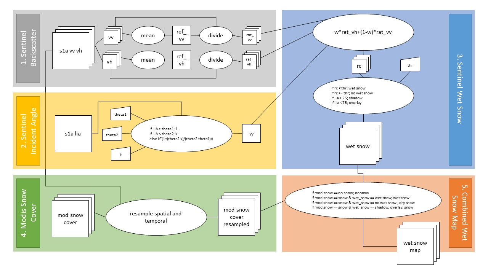

# openeo_eurac_uc_wetsnow
Euracs OpenEO use case "Wet Snow" using Sentinel 1 Backscatter and the Eurac MODIS Snowcover Product. 

## description
The implementation of "UC4:  Snow Monitoring with radar and optical EO data" creates a wet snow map using Sentinel-1 radar data and the Modis Snow Cover Product created by Eurac. 
1. In the first step every timestep of the Sentinel-1 backscatter data is normalized with the mean of the time series for the two polarizations VV and VH. 
2. In the second step the Sentinel-1 local incident angle is classified into a weight layer. 
3. The time series of the normalized backscatter images and the weight layer are combined in a *thrid step* to retrieve a wet snow map solely based on Sentinel-1 data. 
4. In the fourth step the Modis Snow Cover Product from Eurac is resampled to the temporal and spatial resolution of the Sentinel-1 backscatter data. 
5. Finally, in the fifth step the Sentinel-1 wet snow map and the resample Modis snow cover map are combined. These two layers of information allow to extract the four classes "no snow", "wet snow", "dry snow" and "snow" for every available time step. 

The flowchart below describes the workflow which will be implemented with the openEO R-client and R-UDFs.

## use case description OpenEO
* link to description
* openEO project delivery d24: https://www.overleaf.com/project/5d0235ec0a86e75da09ce420

## tools
* openeo editor: https://editor.openeo.org/?server=https://openeo.eurac.edu
* openeo r client: https://github.com/Open-EO/openeo-r-client
* openeo r udf: https://github.com/Open-EO/openeo-r-udf

## datasets
### modis snow product
link to product description/metadata

### sentinel 1 backscatter
link to preprocessing wokflow/metadata

